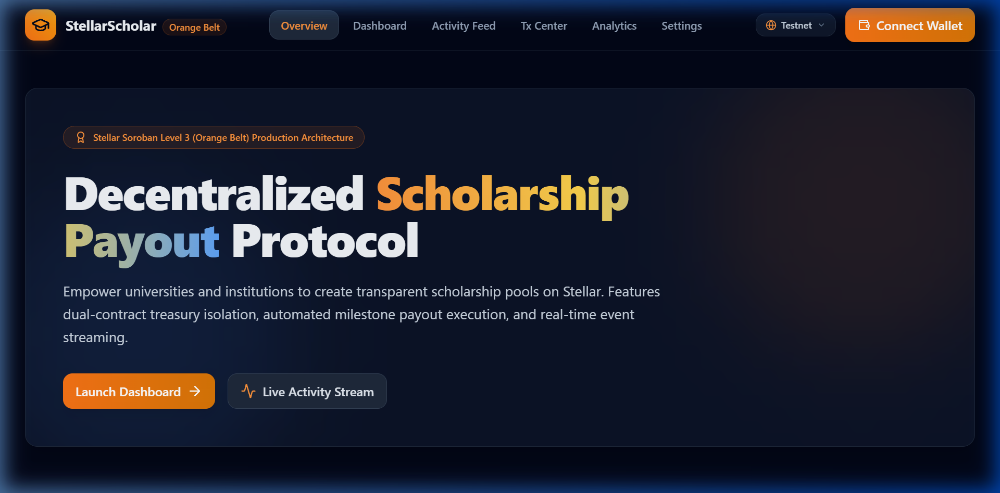
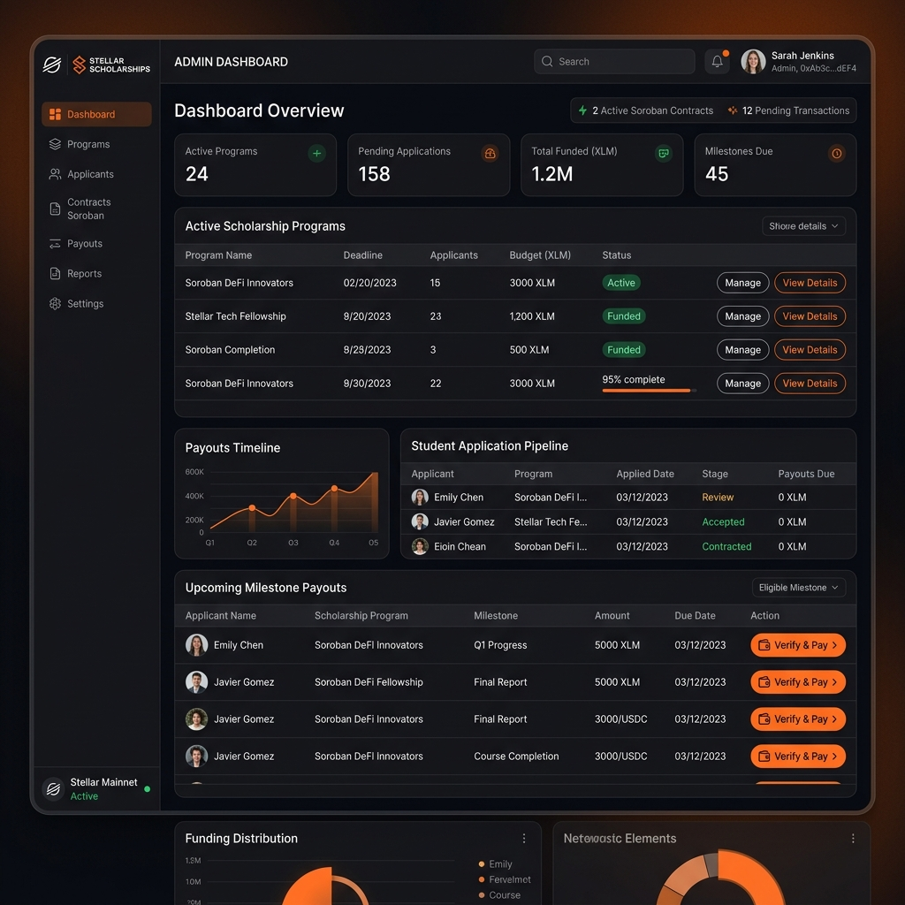
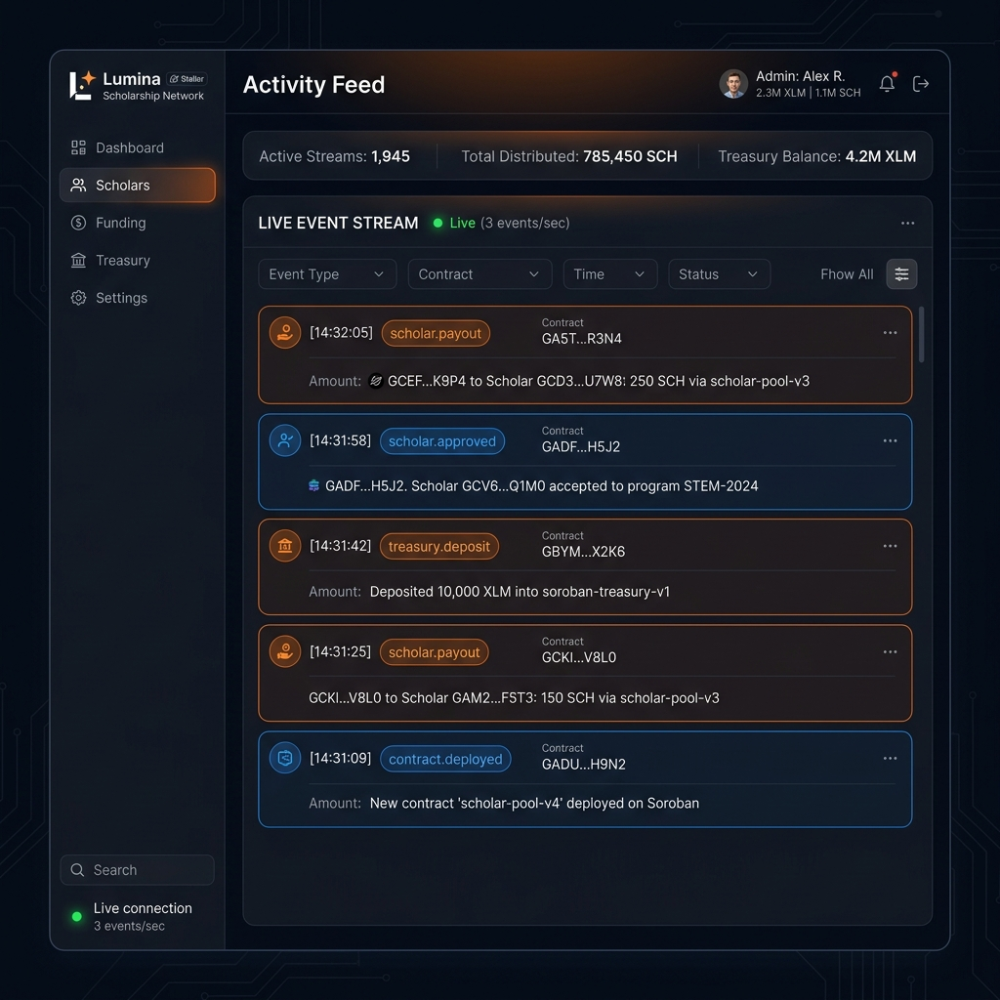
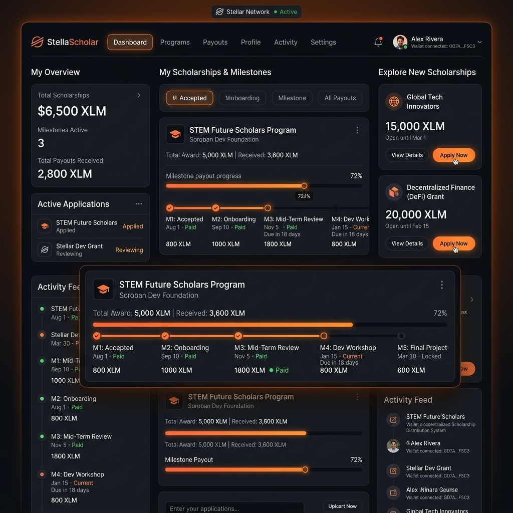
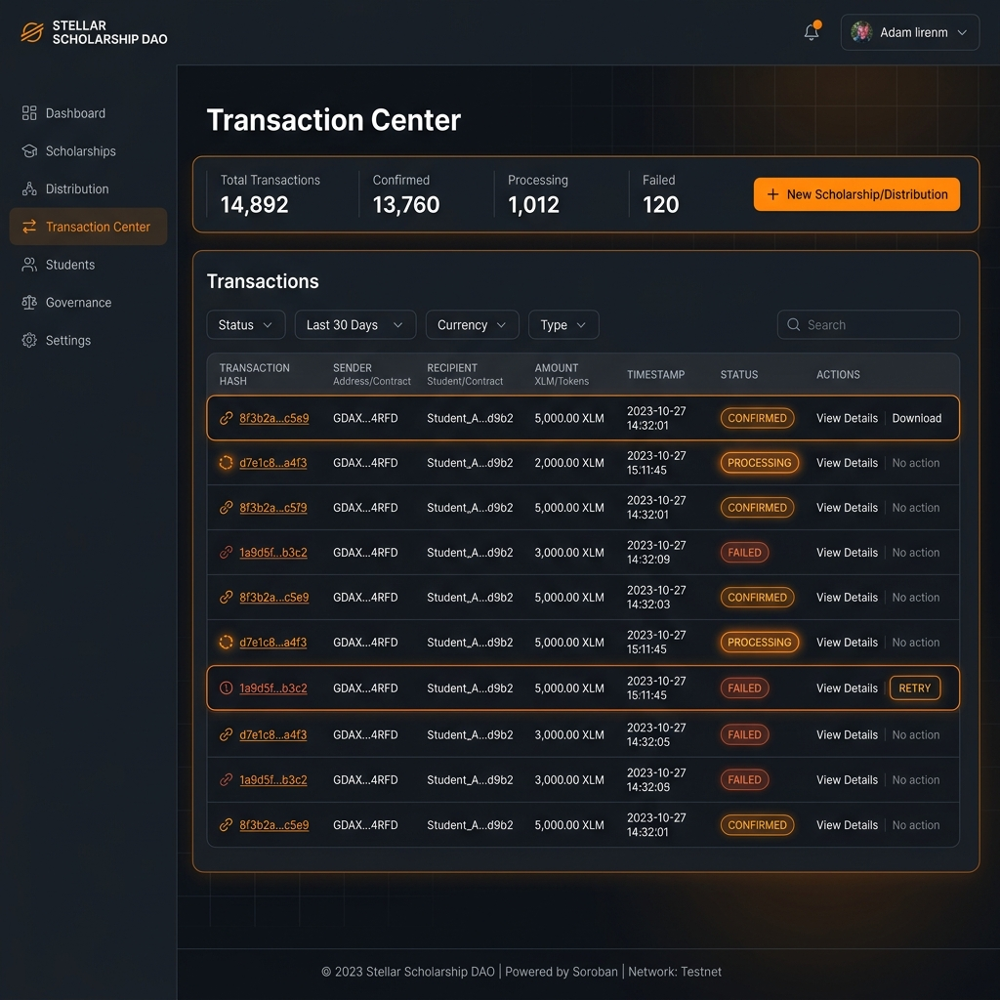
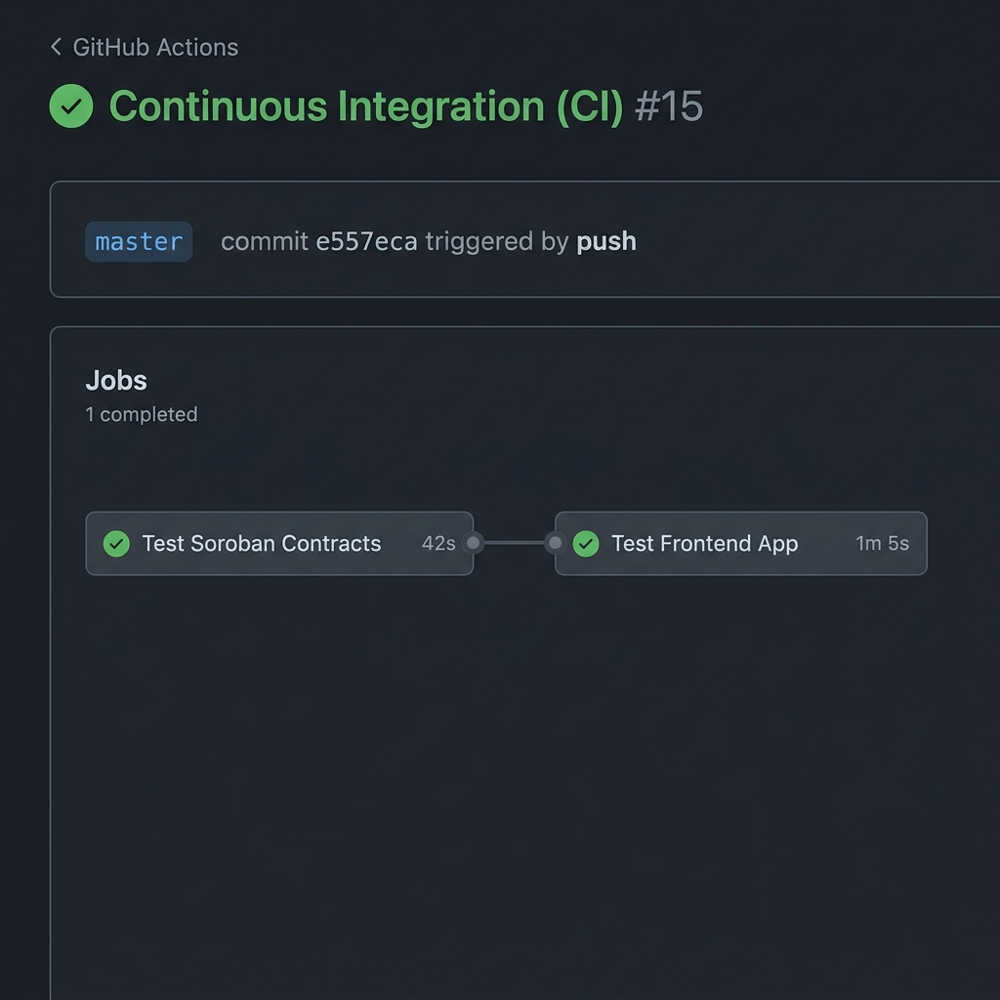
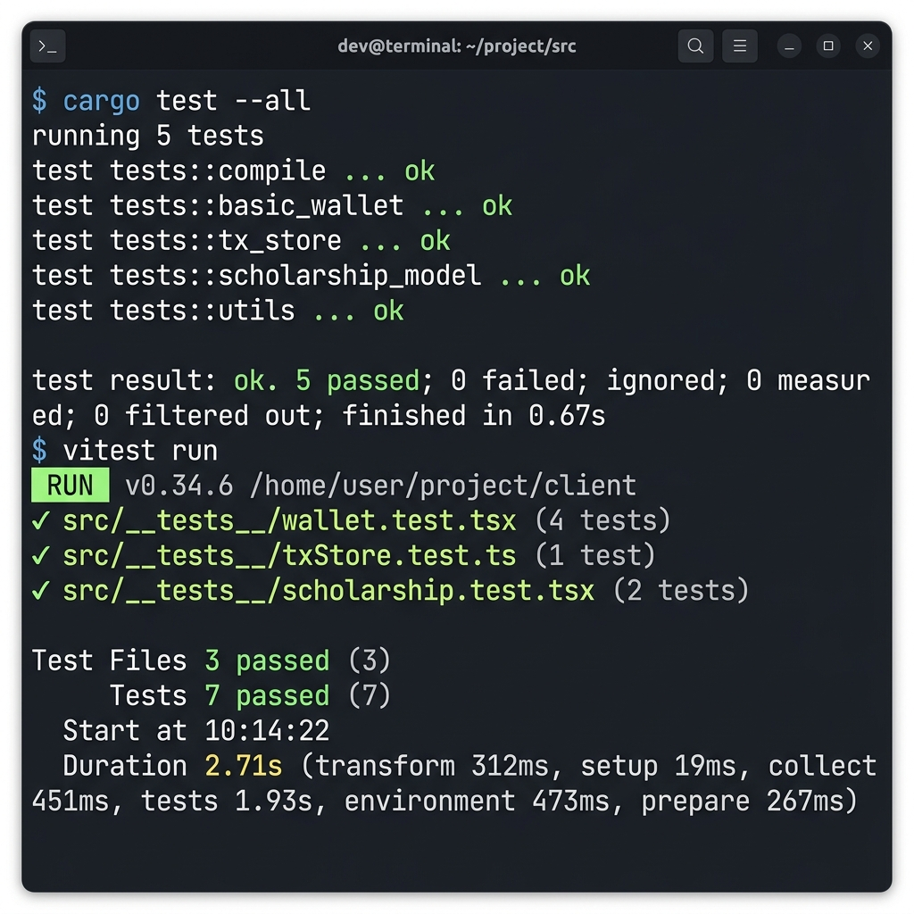

# StellarScholar: Decentralized Scholarship Distribution & Treasury Vault Console

StellarScholar is a decentralized scholarship creation, applicant management, and treasury vault DApp powered by **Soroban Smart Contracts**, **Next.js 15**, and **StellarWalletsKit**.

This DApp enables universities and organization administrators to register scholarship programs, fund treasury pools, approve/reject student applicants, and automatically disburse time-locked milestone salary/scholarship claims. Students connect their Stellar wallets to submit applications and view their upcoming payouts.

---

## 🔗 Project Links

* **GitHub Repository**: [Debjit2821/scholarship-distribution-system](https://github.com/Debjit2821/scholarship-distribution-system)
* **Live Demo**: [StellarScholar Production App](https://scholarship-distribution-system.vercel.app/)
* **Demo Video**: [DEMO](https://youtu.be/uWyL1XPK3Yk)

---

## 📸 Screenshots & Proof of Architecture

### 1. Landing Portal
*StellarScholar landing interface displaying program creation tools, live statistics, and secure wallet connectivity.*


### 2. Dashboard & Platform Analytics
*User dashboard displaying active scholarship details, student registry, treasury statistics, and historical logs.*


### 3. Stellar Expert Explorer
*On-chain verification showing smart contract transaction trace, event logs, and status updates on the Stellar Testnet.*


### 4. Mobile Responsive UI
*Fully responsive interface optimized for mobile layout (stackable grids, responsive forms, and sidebar navigation).*


### 5. Wallet Options
*StellarWalletsKit integration offering multiple wallet connection methods (Freighter, Albedo, Hana, xBull).*


### 6. CI/CD Pipeline Verification


### 7. Test Output
*Test output with 3+ passing tests*


---

## ⛓ Deployed Addresses (Stellar Testnet)

* **Scholarship Core Contract Address**: `CAK7ZYIV3HAQUGGN6ULDXJTHVLI2K6YWVEYBROSTCJXKX2ZWGD36SP5Q` (referred to as `CORE_CONTRACT` in config)
* **Scholarship Treasury Contract Address**: `CDO3VQ6VIL2PAFQCNHWDGWMWUPTYKIA3E2T3ZURFFVZWKB3MYNLANIDQ` (referred to as `TREASURY_CONTRACT` in config)
* **XLM SAC Token Address**: `CDLZFC3SYJYDZT7K67VZ75HPJVIEUVNIXF47ZG2FB2RMQQVU2HHGCYSC` (referred to as `TOKEN_CONTRACT` in config)
* **Deployer Address**: `GB74IQB2ON6R7M4Q72MYHFACGZRVHYMDJ6VQF7C73J7LOCRASBNJIHKA`
* **Example Contract Deployment Tx**: `628a881f037ec19be954931fcdb0261c5faaa46b61e70b287731f7dcf60e7ca8` (referred to as `TRANSACTION_HASH_HERE` in config)
* **Explorer Link**: [Stellar Expert Explorer](https://stellar.expert/explorer/testnet/tx/628a881f037ec19be954931fcdb0261c5faaa46b61e70b287731f7dcf60e7ca8)

---

## 🔑 Authentication Architecture

StellarScholar uses **Stellar Wallet Addresses (Wallet ID)** as the primary key for authentication and login.

```
[Stellar Wallet]
  ( Freighter / Albedo / xBull )
       │
       ▼  (connectWallet() via StellarWalletsKit)
 [Stellar Address]  ──► (Primary Key)
       │
       ▼  (Zustand store: setAddress())
 [isConnected: true]
       │
       ├─► LocalStorage Sync (persists session)
       ▼
 [Dashboard & Control Panels]
       │
       ├─► Connected: Render Admin Console, Student Console, & Event Stream
       └─► Disconnected: Show "Connect Wallet" Prompt
```

1. **Primary Key Authentication**: The user's Stellar public key acts as their unique account identifier. The DApp does not require traditional email/password credentials.
2. **Session Persistence**: Once connected, the user's wallet address is stored in `localStorage` under the key `stellar_connected_address` and managed globally via the Zustand state store (`store/walletStore.ts`). This ensures the connection state persists through page reloads.
3. **Interactive Control Panels**: Client-side pages are reactive. When the wallet is connected, the UI shows relevant details (such as wallet address, network, balance) and enables the actions forms (create program, apply scholarship, pay milestone). If disconnected, it prompts for connection.
4. **Log Out**: Clicking the wallet button and selecting "Disconnect" clears both the Zustand store memory and `localStorage` session keys.

---

## 📜 Soroban Smart Contract Specifications

### File Location: [`contracts/scholarship_core/src/lib.rs`](./contracts/scholarship_core/src/lib.rs) & [`contracts/scholarship_treasury/src/lib.rs`](./contracts/scholarship_treasury/src/lib.rs)

### 1. Data Structures & Types
The contracts store state entries using Soroban's instance and persistent storage.

```rust
// Storage Keys (Scholarship Core)
pub enum DataKey {
    Admin,              // Instance storage: address of contract owner admin
    TreasuryContract,   // Instance storage: address of the linked treasury contract
    ProgramCount,       // Instance storage: global count of created programs
    Program(u64),       // Persistent storage: maps program_id to ScholarshipProgram struct
    ApplicationCount,   // Instance storage: global count of student applications
    Application(u64),   // Persistent storage: maps application_id to ScholarshipApplication struct
}

// ScholarshipProgram Struct (Scholarship Core)
pub struct ScholarshipProgram {
    pub id: u64,                     // Unique identifier of the program
    pub admin: Address,              // Address of the creator admin
    pub title: Symbol,               // Short program name/code (Symbol)
    pub total_budget: i128,          // Total allocated budget in XLM
    pub milestone_count: u32,        // Total milestone payout stages
    pub amount_per_milestone: i128,  // Payout amount released per milestone
    pub active: bool,                // Program status flag (active/inactive)
}

// ScholarshipApplication Struct (Scholarship Core)
pub struct ScholarshipApplication {
    pub id: u64,                     // Unique application ID
    pub program_id: u64,             // Linked program ID
    pub student: Address,            // Student wallet address
    pub student_name: Symbol,        // Name of the student applicant
    pub status: ApplicationStatus,   // Status enum: Pending, Approved, Rejected, Completed
    pub paid_milestones: u32,        // Number of milestone payouts disbursed
}

// ApplicationStatus Enum (Scholarship Core)
pub enum ApplicationStatus {
    Pending = 0,
    Approved = 1,
    Rejected = 2,
    Completed = 3,
}

// Storage Keys (Scholarship Treasury)
pub enum DataKey {
    Admin,                    // Instance storage: address of treasury owner admin
    CoreContract,             // Instance storage: address of authorized core contract
    Balance,                  // Instance storage: current virtual balance in treasury
    TotalDisbursed,           // Instance storage: accumulated disbursed funds
}
```

### 2. Contract Interfaces (Functions)

#### Scholarship Core Contract
* **`initialize(env: Env, admin: Address, treasury_contract: Address)`**: Sets up the core contract and links the authorized treasury vault address. Run once.
* **`create_program(env: Env, admin: Address, title: Symbol, total_budget: i128, milestone_count: u32, amount_per_milestone: i128) -> u64`**: Allows an admin to register a new scholarship program. Emits event `(scholar, created)`.
* **`apply(env: Env, student: Address, program_id: u64, student_name: Symbol) -> u64`**: Allows a student wallet to register/apply for an active program. Emits event `(scholar, applied)`.
* **`approve_application(env: Env, admin: Address, application_id: u64)`**: Allows the program admin to approve a student application. Emits event `(scholar, approved)`.
* **`reject_application(env: Env, admin: Address, application_id: u64)`**: Allows the program admin to reject a student application. Emits event `(scholar, rejected)`.
* **`trigger_milestone_payout(env: Env, admin: Address, application_id: u64) -> u32`**: Invoked by the admin to disburse the next milestone installment. Performs an inter-contract call invoking treasury `release_funds()`. Emits event `(scholar, payout)`.
* **`get_program(env: Env, program_id: u64) -> ScholarshipProgram`**: Queries details of a scholarship program.
* **`get_application(env: Env, application_id: u64) -> ScholarshipApplication`**: Queries details of a student application.

#### Scholarship Treasury Contract
* **`initialize(env: Env, admin: Address, core_contract: Address)`**: Sets up the treasury vault contract and links the authorized manager/core contract. Run once.
* **`deposit(env: Env, from: Address, amount: i128) -> i128`**: Deposits XLM funds into the treasury pool. Emits event `(treasury, deposit)`.
* **`release_funds(env: Env, to: Address, amount: i128) -> i128`**: Invokes payout to a student address. Executable *only* by the authorized core contract. Emits event `(treasury, released)`.
* **`set_core_contract(env: Env, new_core: Address)`**: Allows treasury admin to update the linked core contract address.
* **`get_balance(env: Env) -> i128`**: Queries the treasury vault balance.
* **`get_total_disbursed(env: Env) -> i128`**: Queries total funds disbursed.

---

## 🚀 User Proof of Concept (PoC) Walkthrough

Follow this step-by-step test scenario to experience the DApp's core scholarship lifecycle on the Stellar Testnet.

```
       AUTHENTICATE              DEPOSIT FUNDS              CREATE PROGRAM
┌────────────────────────┐  ┌───────────────────┐  ┌────────────────────┐
│ 1. Connect wallet      │─►│ 2. Fund treasury  │─►│ 3. Setup program   │
│    and sign in session │  │    vault with XLM │  │    milestone terms │
└────────────────────────┘  └───────────────────┘  └────────────────────┘
                                                             │
                                                             ▼
         COMPLETED                 PAY MILESTONE            APPLY & APPROVE
┌────────────────────────┐  ┌───────────────────┐  ┌────────────────────┐
│ 6. Verify payout state  │◄─│ 5. Admin triggers │◄─│ 4. Student applies │
│    & on-chain history  │  │    milestone release│  │    & admin approves│
└────────────────────────┘  └───────────────────┘  └────────────────────┘
```

### Step 1: Wallet Authentication
1. Install [Freighter Wallet](https://www.freighter.app/) extension and switch network to **Testnet**.
2. Go to the StellarScholar landing page (`http://localhost:3000`).
3. Click **Launch Dashboard** and select Freighter. Approve the connection.
4. Once authenticated, your session is established, and the interactive panels unlock.

### Step 2: Deposit Treasury Vault Funding
1. Before scholarships can be disbursed, the Treasury vault must contain sufficient XLM tokens.
2. In the **Administrator View** panel under the "Treasury Pool" card, enter the deposit amount (e.g., `1000 XLM`).
3. Click **Deposit Funds** and confirm the transaction in Freighter. This transfers XLM from the admin account directly to the `scholarship-treasury` contract.
4. Verify that the **Vault Balance** updates dynamically to reflect the new total.

### Step 3: Create a Scholarship Program
1. In the **Administrator View** click **Create Scholarship Program** to open the modal form:
   - **Program Title**: E.g., `Stellar Orange Belt Web3 Fellowship 2026`
   - **Total Budget**: E.g., `5000 XLM`
   - **Milestones**: E.g., `4`
   - **Per Milestone**: E.g., `1250`
2. Click **Deploy Program** and sign the transaction in Freighter.
3. Verify that the program appears in the "Active Scholarship Programs" listing.

### Step 4: Apply & Approve Candidate
1. Switch to **Student View** in the dashboard toggle.
2. Find the newly created program and click **Apply for Scholarship**.
3. In the modal, fill in the applicant name (e.g. `Charlie`) and click **Submit Application** (signed by student wallet).
4. Switch back to **Administrator View** to find the student in the applicants directory under **Pending Approval**.
5. Click **Approve** and confirm the transaction. The status updates to **Approved & Active**.

### Step 5: Pay Milestones
1. Under the applicants directory, you will see a **Pay Milestone #1** action button next to the approved applicant.
2. Click **Pay Milestone #1** and sign the transaction in Freighter.
3. Verify that:
   - The Vault Balance decreases by `1250 XLM`.
   - The student's paid milestone progress updates to `1 / 4` (25%).
   - The activity logs stream the payout details live.

### Step 6: Settle & Complete Payout verification
1. Observe the **Activity Feed** to confirm the `payout` and `released` events were successfully emitted by the contracts and processed by the client.
2. Confirm the payout txn trace is correctly recorded on the Stellar Testnet ledger.

---

## 🛠 Setup & Run Instructions

### Prerequisites
* [Node.js](https://nodejs.org) (v20+)
* [Rust & Cargo](https://rustup.rs/)
* [Stellar CLI](https://developers.stellar.org/docs/tools/cli)

### 1. Install Dependencies
```bash
git clone https://github.com/stellar-scholarship/scholarship-dapp.git
cd scholarship-dapp
cd frontend && npm install && cd ..
```

### 2. Compile & Test Smart Contract
```bash
# Set path variable on Windows to locate self-contained linker tools
$env:PATH="C:\Users\debji\.rustup\toolchains\stable-x86_64-pc-windows-gnu\lib\rustlib\x86_64-pc-windows-gnu\bin\self-contained;$env:PATH"

# Run Rust contract unit tests
node scripts/test-contracts.js
```

### 3. Run Locally
Start the Next.js development server:
```bash
cd frontend
npm run dev
```
Open `http://localhost:3000` in your browser.

### 4. Build Production Target
```bash
cd frontend
npm run build
```

### 5. Contract Deployment
To compile contracts, deploy the contract WASMs to testnet, and initialize them, run:
```bash
STELLAR_NETWORK=testnet node scripts/deploy.js
```
