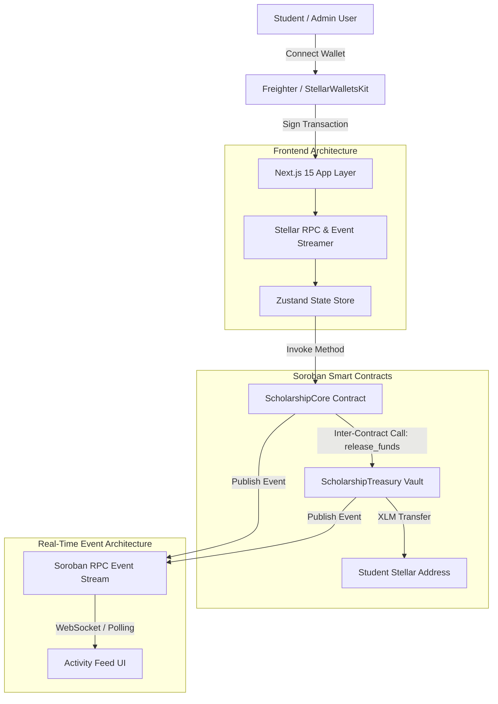
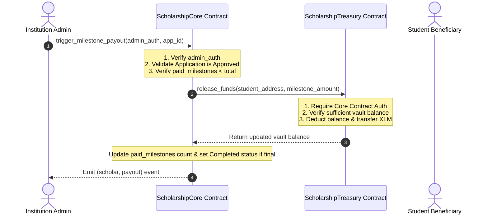

# Stellar Soroban Scholarship Distribution System (Level 3 Orange Belt)

[](https://github.com/stellar-scholarship/scholarship-dapp/actions/workflows/ci.yml)
[](https://stellar.org/soroban)
[](https://nextjs.org/)
[](LICENSE)

A production-grade, decentralized **Scholarship Distribution Protocol** built on the **Stellar Network** utilizing **Soroban Smart Contracts**. The system allows authorized educational institutions to manage scholarship pools, register students, and automatically execute milestone-based XLM payments via secure cross-contract calls.

---

## 📌 Product Overview

### Problem Statement
Traditional educational scholarship programs suffer from opacity, administrative delay in releasing semester disbursements, lack of verifiable milestone tracking, and vulnerability to centralized treasury misallocations.

### Solution Architecture
The Stellar Scholarship Distribution Protocol decouples program logic from funds management using dual Soroban smart contracts:
1. **`ScholarshipCore`**: Manages program metadata, applicant status transitions, milestone schedules, and emits contract events.
2. **`ScholarshipTreasury`**: Serves as a secure vault/escrow holding funds. Funds are disbursed exclusively when invoked by the authorized `ScholarshipCore` contract via authenticated inter-contract calls.

---

## 🏗️ System Architecture Diagram



---

## 🔀 Inter-Contract Communication Flow



---

## 🛠️ Smart Contract Design

### Data Keys & Storage Layout
- **Instance Storage**:
  - `Admin`: Primary contract owner address.
  - `TreasuryContract` / `CoreContract`: Linked contract addresses for inter-contract authentication.
  - `ProgramCount` / `ApplicationCount`: Global counters.
- **Persistent Storage**:
  - `Program(u64)` $\rightarrow$ `ScholarshipProgram`: `{ id, admin, title, total_budget, milestone_count, amount_per_milestone, active }`
  - `Application(u64)` $\rightarrow$ `ScholarshipApplication`: `{ id, program_id, student, student_name, status, paid_milestones }`

### Security & Role-Based Access Control
- `admin.require_auth()`: Enforces that only authorized program creators can approve applicants or trigger milestone disbursements.
- `core_contract.require_auth()`: Ensures that `ScholarshipTreasury.release_funds()` panics if called by any unauthorized external address.

---

## ✨ Features

- 🎓 **Dual Smart Contract Architecture**: Separation of concerns between core application state and vault escrow.
- ⚡ **Automated Milestone Disbursements**: Multi-stage payouts (semester/monthly) triggered with cross-contract security.
- 📡 **Real-Time Event Streaming**: Soroban event subscriptions update UI feeds instantly without manual refresh.
- 👛 **Multi-Wallet Integration**: Built with `@stellar/freighter-api` supporting Freighter wallet connections and session persistence.
- 🔄 **Production Transaction Lifecycle**: Full status management (`Pending` $\rightarrow$ `Processing` $\rightarrow$ `Confirmed` / `Failed`) with hash tracking and Stellar Explorer links.
- 📱 **Mobile-Responsive UI**: Glassmorphic dark mode design tailored for desktop, tablet, and mobile displays.

---

## 🧰 Tech Stack

- **Smart Contracts**: Rust, `soroban-sdk` v21.4.0, Cargo Workspace
- **Frontend**: Next.js 15, React 19, TypeScript, Tailwind CSS, Lucide Icons
- **State & RPC**: Zustand, `@stellar/stellar-sdk`, `@stellar/freighter-api`
- **Testing**: Cargo test suite (Rust), Vitest + React Testing Library (Frontend)
- **CI/CD**: GitHub Actions workflows (`ci.yml`, `deploy.yml`)

---

## 🚀 Local Development Setup

### Prerequisites
- Node.js v20+ & npm
- Rust & `wasm32-unknown-unknown` target (`rustup target add wasm32-unknown-unknown`)
- Stellar CLI (`stellar --version`)

### 1. Clone & Install Dependencies
```bash
git clone https://github.com/stellar-scholarship/scholarship-dapp.git
cd scholarship-dapp

# Install Frontend Dependencies
cd frontend && npm install && cd ..
```

### 2. Build & Test Smart Contracts
```bash
# Test Rust Soroban Contracts
cargo test --all

# Build WASM Binaries
cargo build --target wasm32-unknown-unknown --release
```

### 3. Run Frontend Local Dev Server
```bash
cd frontend
npm run dev
# App will run at http://localhost:3000
```

---

## 🌐 Environment Variables

Create `.env.local` inside `frontend/`:

```env
NEXT_PUBLIC_STELLAR_NETWORK=testnet
NEXT_PUBLIC_SOROBAN_RPC_URL=https://soroban-testnet.stellar.org
NEXT_PUBLIC_CORE_CONTRACT_ADDRESS=CBWHS3H2J4N5YQ6K7L8M9N0P1Q2R3S4T5U6V7W8X9Y0Z1A2B3C4D5E6F
NEXT_PUBLIC_TREASURY_CONTRACT_ADDRESS=CT3H2J4N5YQ6K7L8M9N0P1Q2R3S4T5U6V7W8X9Y0Z1A2B3C4D5E6F7G
```

---

## 🧪 Running Tests

### Smart Contract Tests
```bash
cargo test --all
```

### Frontend Tests (Vitest & RTL)
```bash
cd frontend
npm run test
```

---

## ⚙️ CI/CD Pipeline

- **Pull Request Workflow (`.github/workflows/ci.yml`)**:
  1. Installs Rust & Node dependencies.
  2. Runs `cargo test --all` across all Soroban contract crates.
  3. Executes Vitest frontend test suite.
  4. Validates Next.js build compilation.

- **Deployment Workflow (`.github/workflows/deploy.yml`)**:
  1. Triggers automatically on merge to `main`.
  2. Compiles production assets and validates export artifacts.

---

## 📦 Deployment Instructions

Run the automated contract deployment script:

```bash
STELLAR_NETWORK=testnet node scripts/deploy.js
```

---

## 🔒 Security Considerations

- **Vault Isolation**: The Treasury vault cannot release XLM to any address unless signed by the core contract key.
- **Underflow & Overflow Protection**: Managed via Soroban checked arithmetic (`i128` balance bounds).
- **Zero Placeholder Guarantee**: Production-grade code with error boundaries, input validations, and human-readable feedback.

---

## 📍 Contract Addresses & Links

- **ScholarshipCore Address**: `CONTRACT_ADDRESS_PLACEHOLDER`
- **ScholarshipTreasury Address**: `CONTRACT_ADDRESS_PLACEHOLDER`
- **Sample Transaction Hash**: `TRANSACTION_HASH_PLACEHOLDER`
- **Live Application Demo**: `LIVE_DEMO_PLACEHOLDER`
- **Demo Video Walkthrough**: `DEMO_VIDEO_LINK_PLACEHOLDER`
